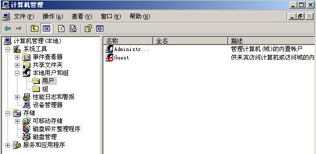

# 用户和组

- 版本介绍
  - windows服务器系统：win2000, win2003, win2008, win2012
  - linux服务器系统：Redhat, CentOs

- 用户管理
  - 用户概述
    - 每个账户有自己唯一的SID(安全标识符)
    - S-1-5-21-426206823-2579496042-14852678-500
    - PS: S-1-5-21-426206823-2579496042-14852678是随机生成的，一个电脑中所有的用户都一样，500是用户唯一的，各个用户不同。系统ID+用户ID
    - 在Windows中：500是固定给administrator用，普通用户是1000开始排号的
  - 账户密码存储在：c:\windows\system32\config\SAM，#暴力破解
  - windows系统的服务器，默认密码最长有效期42天，你可以修改时间，防止有人爆破

- 内置账户
  - 给人用的账户(系统自带，删也删不掉)
    - administrator：管理员账户
    - guest：来宾账户
  - 计算机服务组件相关的系统账户
    - system：系统账户，权限至高无上
    - local services：本地服务账户，权限等于普通用户
    - network services：网络服务账户，权限等于普通用户
  - 配置文件
    - 每个用户都有自己的配置文件(家目录)，用户在第一次登录时自动产生，路径是：win7/win2008: `c:\用户\`。xp/2003：`c:\Documents and Settings\`

- 用户管理命令

  - `net user`：查看用户

  - `net user xxx yyy`：将用户xxx的密码修改为yyy，管理员才可以

  - `net user xxx yyy /add`：添加一个用户xxx，密码是yyy

  - `net user xxx /del`：删除用户xxx
  - `net user xxx /active:yes/no`：激活后者禁用账户xxx

- 组管理
  - 组作用：简化权限的赋予
  - 赋权限方式
    - 用户---组---赋权限
    - 用户---赋权限
  - 内置组：内置组的权限默认已经被系统赋予
    - administrators：管理员组
    - guests：来宾组
    - users：普通用户组
    - network.......：网络配置组
    - print：打印机组
    - Remote Desktop：远程桌面组
  - 组管理
    - `net localgroup`：展示所有用户组
    - `net localgroup xxx`：展示xxx组的所有成员
    - `net localgroup xxx yyy /add`：将用户yyy加入到xxx组
    - `net localgroup xxx yyy /del`：将用户yyy从xxx组删除

