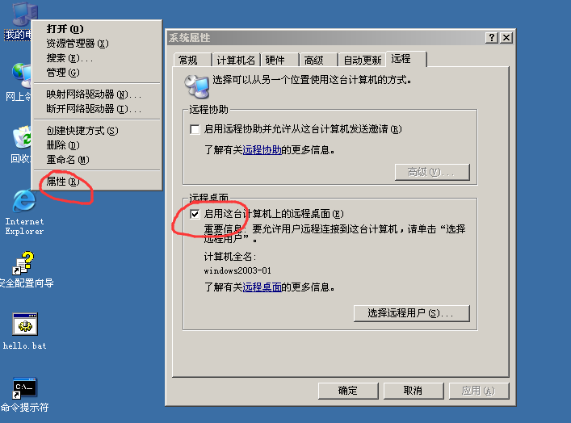

# 服务器远程管理

## 远程控制

1. 双方能相互ping通，对方开启了远程桌面。
2. 运行输入`mstsc`，输入对方的ip地址即可连接。
3. 注意，登录的账户需要处于`Remote Desktop Users`组或者拥有它的权限

## telnet

1. 对方运行输入`services.msc`
2. 对方找到Telnet，启动
3. 我方打开cmd，输入`telnet [对方ip]`
4. 输入账户密码，注意：此账户需要是TelnetClients组的成员

## 端口号

查看本地所有开放的端口：`netstat -an`

远程桌面协议RDP端口：3389

telnet端口号：23

