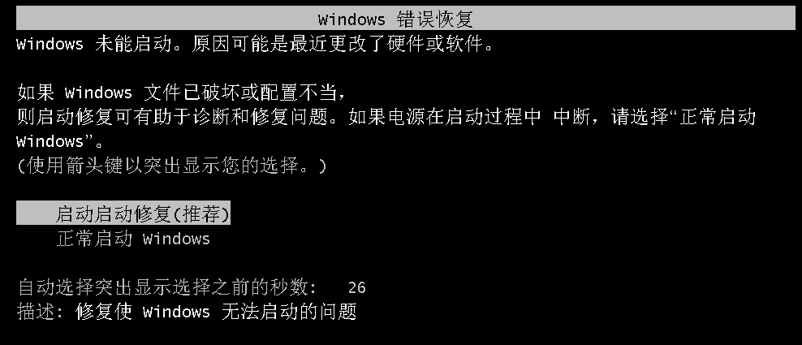
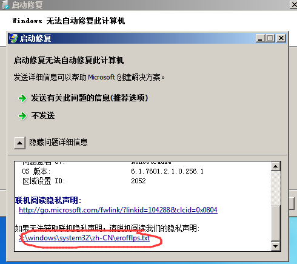
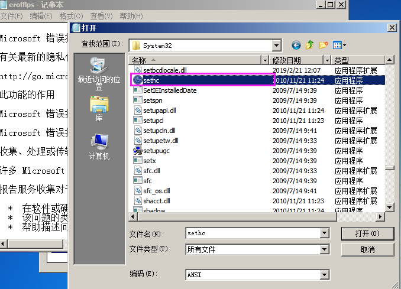
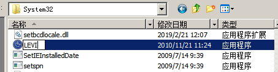
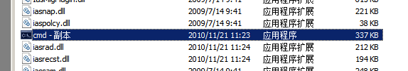
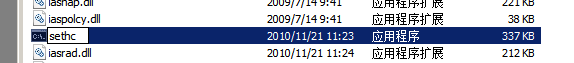
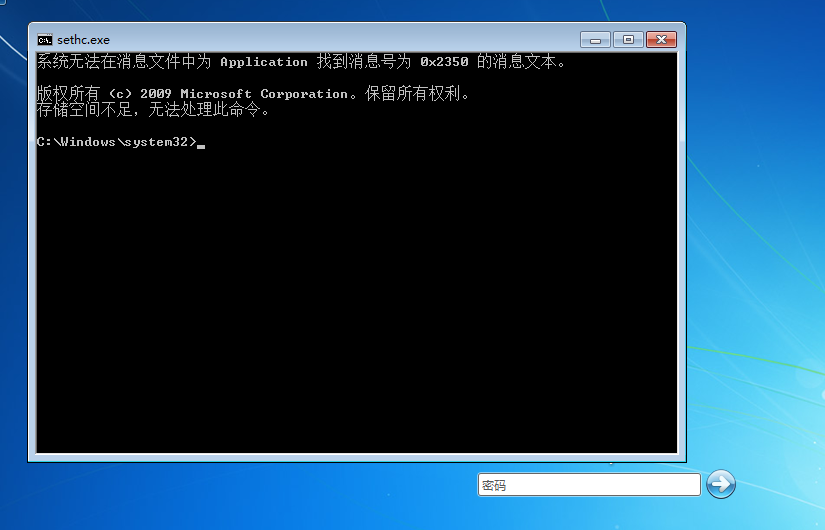
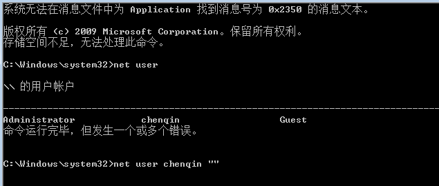
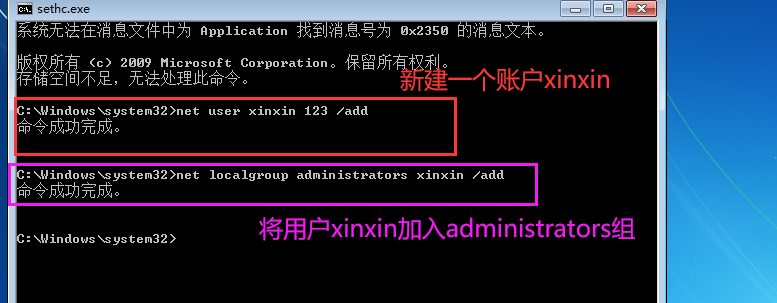

# 破解系统秘密

## 5次shift漏洞

在Win7和win10中（部分），未登录系统时

破解知识

- cmd工具路径：c:\windows\system32\cmd
- 用户/账户密码存储位置：c:\windows\system32\config\SAM
- 修改账户密码：net user 用户名 新密码

破解过程

1.按五次shift键，弹出一个提示“粘滞键”。【c:\windows\system32\sethc.exe】

2.启动电脑，在Windows启动界面加载的时候强制关机

3.再次启动电脑，直到出现下图(启动修复)，选择启动启动修复

4.遇到启动修复，选择取消！！！

5.选择查看问题详细信息，点击记事本内容

6.找到sethc程序

7.重命名为任意内容

8.找到cmd，复制粘贴

9.重命名为sethc

10.点击完成

11.重启电脑，连续按五次shift，从图中的system32可以看出，这是以system用户打开的，即管理员账户打开的

12.重设密码，这里以情况密码为例

13.点击确认即可进入

为了防止账户主人知道我们改了密码，我们可以新建用户登录

1.五次shift

2.重启电脑

3.干完坏事之后，记得删除此用户哦

4.后期，还可以继续毁尸灭迹，将log日志也清空
