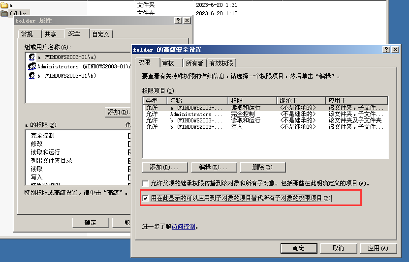
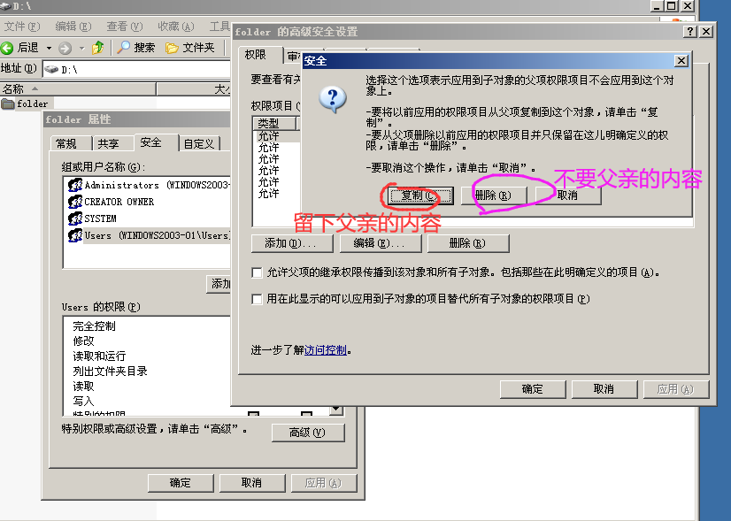
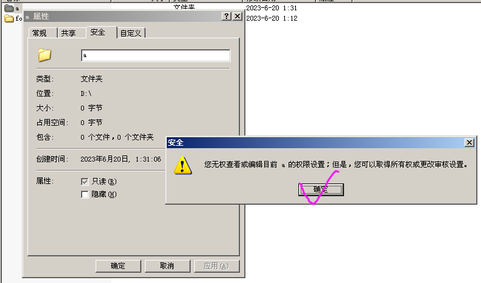
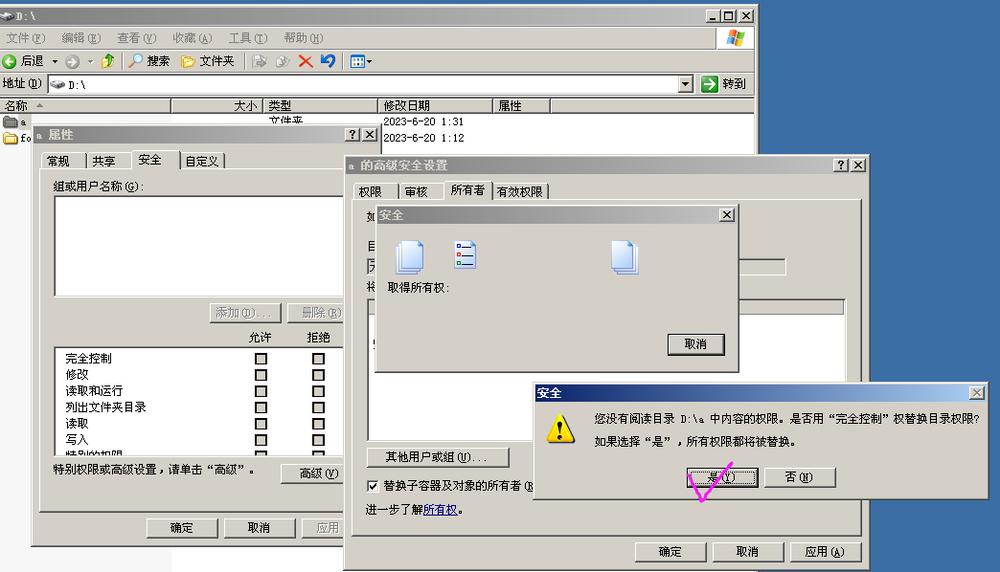

# NTFS权限

组权限是对于系统运作，NTFS是针对文件夹

## 作用

1. 通过设置NTFS权限，实现不同的用户访问不同对象(文件、文件夹)的权限
2. 分配了正确的访问权限后，用户才能访问其资源
3. 设置权限防止资源被篡改、删除

## 概述

文件系统即在外部存储设备上组织文件的方法，常用的文件系统：

- FAT: windows
- NTFS: windows
- EXT: linux

## NTFS文件系统特点

- 提高磁盘读写性能
- 可靠性
  - 加密文件系统
  - 访问控制列表(设置权限)
- 磁盘利用率
  - 压缩
  - 磁盘配额
- 支持单个文件大于4个G

## 强制继承

让子权限全部强制变为父文件的权限

- 同一个磁盘

  - 如果是复制进去的文件，则权限更新为父文件的权限。

  - 如果是移动(剪切)进去的文件，则权限不变

- 不同磁盘

  - 如果是复制进去的文件，则权限更新为父文件的权限。
  - 如果是移动(剪切)进去的文件，则权限更新为父文件的权限。

## 实操1

上方

- CREATOR OWNER：创建此文件\文件夹的人

下方

- 完全控制：包含特别的权限
- 修改：包括读取和运行，列出文件夹目录，读取，删除
- 列出文件夹目录
- 读取
- 写入
- 特别的权限：用户可以修改此ACL

如何修改此表

1.脱离父子继承关系

2.点击高级

3.现在即可任意修改此表

- 注意：这只是修改了这个文件夹的父亲关系，而子关系是继承的

- 当用户属于多个组的时候，权限是累加的，但是拒绝是一票否决

## 实操2

情景：用户a创建了一个文件，但是他设置了所有权是自己，除了自己任何人都不可以查看修改此文件，包括管理员，那么管理员怎么做呢？

1.点击安全

2.修改所有权，记得勾选替换子容器及对象的所有者

3.此时修改所有内容
